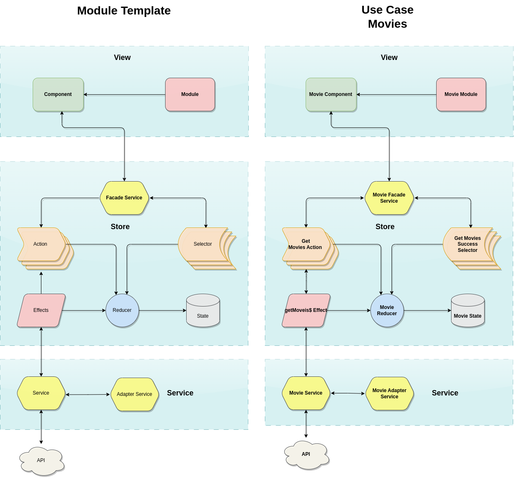

# **Store Based Component Plugin**

The Store Based Component Plugin is an aggregate of technologies and architectural concepts and design patterns that make it easy to create a component that uses state management and API communication under the hood.

This plugin supports being installed in both angular projects created from the stack and by the conventional method.

Next you see more details about the plugin.

- [Plugin core technologies](#plugin-core-technologies)
- [Motivation](#motivation)
- [Architecture](#architecture)
- [Happy Path of information](#happy-path-of-information)

## **Plugin core technologies**

In this session you will know which technologies are part of the Store Based Component Plugin.

The technologies, concepts and design patterns applied in this project are:

- Ngrx/store
    - Actions
    - Reducer
    - Effects
    - Selectors
- Design Patters
    - Facade
    - Adapter
- Some SOLID concepts
    - Single responsability
    - Dependency Inversion

### **Motivation**

The motivation to create this plug-in can be divided into two factors:
- Abstraction of the implementation complexity, as it is known that there is a certain barrier in terms of the learning curve and use by some developers (mainly Junior seniority). .

- Gain time to create a state management structure within an Angular application, because due to the complexity, a task to develop a structure like this, depending on the degree of knowledge of the developer, can take more than a day of hard work.
We understand that quality is non-negotiable, and we look to technologies and methodologies as a means to obtain the much-desired software quality. This premise was the guide for choosing each technology detailed below.

## **Architecture**
In the following image you can see the architecture of the plugin:

In the following image you can see the architecture of the plugin:

The architecture designed for this component aims to ensure that the complexity in using state management is abstracted to the view layers, using a facade service as an orchestrator for all interaction with the store.

Other interesting details are that the service layer has an adapter that makes it possible to pre-process the information before any request and after any response. Of course, this point may become optional depending on the context.

## **Happy Path of information**
Basically following the flow of the happy path, we have:
1. The application from the view requests a list of items to be displayed;
2. The component calls a Get List method of the facade service.
3. The Facade service understands that it has to dispatch an action with the intention of storing data in the store.
4. Effect intercepts this action and triggers the service that communicates with the API.
5. The Api returns the information to the service, which in turn triggers a new success action in the effect, otherwise it triggers a failure action.
6. The successful Action is captured by the reducer, which recovers its payload and stores it in the state.
7. The Selector responsible for listening to successful changes in the list attribute of the state starts issuing the new value.
8. In The facade service, getList method understands that there is a new value being emitted by the selector and returns the observable to the component.
9. The component can then display the information to the user.
