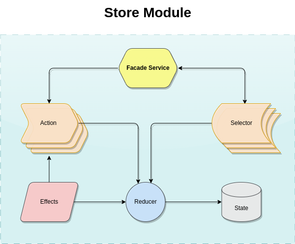

# **Store Module Plugin**

The Module Store Plugin is a tool that facilitates the creation of a state manager and all the complexity that is the use of actions and selectors is abstracted through a facade service.

This plugin supports being installed in both angular projects created from the stack and by the conventional method.

Next you see more details about the plugin.

- [Plugin core technologies](#plugin-core-technologies)
- [Motivation](#motivation)
- [Architecture](#architecture)

## **Plugin core technologies**

In this session you will know which technologies are part of the Store Module Plugin.

The technologies, concepts and design patterns applied in this project are:

- Ngrx/store
    - Actions
    - Reducer
    - Effects
    - Selectors
- Design Patters
    - Facade

### **Motivation**

The motivation to create this plug-in is:
- The abstraction of the implementation complexity, as it is known that there is a certain barrier in terms of the learning curve and use by some developers (mainly Junior seniority). .

- Gain time to create a state management structure within an Angular application, because due to the complexity, a task to develop a structure like this, depending on the degree of knowledge of the developer, can take more than a day of hard work.

## **Architecture**
In the following image you can see the architecture of the plugin:

In the following image you can see the architecture of the plugin:

The architecture designed for this module follow the documentation of ngrx/store and the implementation of facade service aims to ensure that the complexity in using state management is abstracted to the view layers.